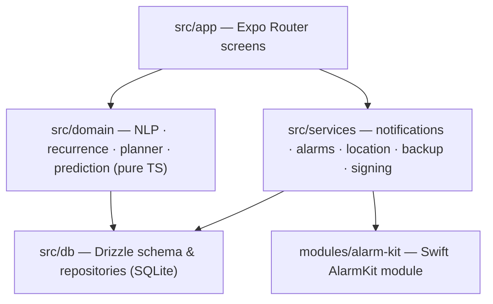

<div align="center">


# Anımsa

**A private, fully on-device iOS assistant for daily tasks and the household.**
No server, no account, no telemetry — your data never leaves the phone.


🇹🇷 [Türkçe README](README.tr.md)

</div>

---

## ✨ Features

| | |
|---|---|
| ⏰ **Tasks** | Add reminders in natural Turkish (`yarın 9'da ilaç` → "medicine tomorrow at 9"); deliver as a notification **or** as a real alarm that breaks through silent mode (AlarmKit) |
| 🛒 **Household list** | Product catalogue, aisle ordering, barcode scanning, expiry-date tracking |
| 📍 **Location** | Shows your shopping list when you approach a market and a checklist when you leave home (geofencing) |
| 🔮 **Prediction** | Learns purchase habits and warns you before you run out ("milk is about to run out") |
| 🔏 **Signature watchdog** | Tracks its own code-signing expiry and warns before it lapses |

## 🧠 Engineering highlights

- **Custom natural-language parser** for Turkish date/time expressions, recurrence engine and planner — written as pure, framework-free TypeScript in `src/domain/`
- **Native Swift module** bridging Apple's **AlarmKit** into React Native (New Architecture)
- **Local-first data layer** with `expo-sqlite` + **Drizzle ORM** and generated migrations
- **371 unit tests** (Jest), strict TypeScript, ESLint and typecheck in CI
- **No Mac required** — every iOS build runs on GitHub Actions macOS runners; releases are distributed through an AltStore source
- Works within the limits of a **free Apple ID** (no special entitlements): no push, iCloud, App Groups or extensions — everything is local notifications, AlarmKit alarms or region monitoring

## 🏗️ Architecture



Details: [docs/MIMARI.md](docs/MIMARI.md) · design decisions: [docs/KARARLAR.md](docs/KARARLAR.md)

## 🚀 Development

```bash
npm ci
npm run typecheck   # tsc --noEmit
npm run lint
npm test            # jest
npm run db:generate # generate migration after schema change

gh workflow run ios.yml -f variant=release   # iOS build on GitHub Actions
```

Installation on a phone is documented step by step in [docs/KURULUM.md](docs/KURULUM.md) (Turkish).

## 🛠️ Tech Stack

Expo SDK 57 · React Native (New Architecture) · TypeScript (strict) · Expo Router · expo-sqlite + Drizzle · expo-notifications (local only) · expo-location (geofencing) · AlarmKit · expo-maps · OpenStreetMap Overpass · Open Food Facts

Minimum iOS **26.0** (required by AlarmKit).

---

<div align="center">
Built by <a href="https://github.com/Bariscompeng">Barış Coşkun</a>
</div>
